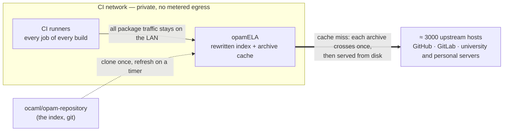

# opamela

> An opam-repository mirror that rewrites the directory instead of proxying it,
> so that building OCaml code reaches exactly one host.


opamela clones [opam-repository](https://github.com/ocaml/opam-repository),
rewrites every `url.src` to point at itself, and serves the result as an
ordinary opam repository. Archives are downloaded once, verified against the
checksum the package declares, and served from disk after that.

It works with unmodified opam. There is no plugin, no wrapper and no special
environment variable: from opam's point of view this is a repository like any
other, which is also what makes it easy to stop using.

## Why a cache in front of opam does nothing

This is worth spelling out, because the obvious solution fails in a way that is
easy to miss and expensive to discover.

An opam repository does not host packages. It is a directory of URLs. Each
`opam` file names the archive's real location, which is a GitHub release, a
GitLab tarball, a university web server or somebody's personal host:

```
url {
  src: "https://github.com/someone/their-package/archive/v1.2.3.tar.gz"
  checksum: "sha256=a3f1..."
}
```

Put an HTTP caching proxy in front of `opam.ocaml.org` and it caches the
directory. Once. Every build then reads that cached directory, finds several
thousand URLs pointing elsewhere, and downloads its packages from exactly the
same hosts as before. The cache is not on the path. It never sees the traffic.

A cache can only cache what goes through it. An ecosystem whose index points at
third-party URLs cannot be cached — only mirrored. So opamela rewrites the index,
and you run it **inside your CI network, next to the runners**:



Two things follow from that placement.

First, the index is rewritten, so a build resolves every dependency through
opamELA instead of chasing several thousand third-party URLs. From opam's side
it is just a repository; it never learns it is talking to a mirror.

Second — and this is where it pays for itself — **each archive crosses the public
internet exactly once.** The first build that needs it pulls it in; every build
afterwards reads it from a host on the same network, at LAN speed.

Without that, every runner on every build re-downloads the same archives from the
public internet. On a large OCaml monorepo — [Tezos](https://gitlab.com/tezos/tezos),
say, with its thousands of CI jobs a day — that repeated egress is not a rounding
error: it is a metered cloud cost that grows with your CI and buys you nothing,
because it is the same bytes fetched over and over. opamELA turns that recurring
bill into a one-time fetch per archive.

## Quick start

```sh
go build -o opamela ./cmd/opamela

./opamela -base-url https://opam.internal -state /var/lib/opamela
```

`-base-url` is required and has no sensible default: it is the URL that gets
written into every package file, so it has to be the address your builds
actually reach.

The first build clones opam-repository and rewrites around 22,000 packages,
which takes a few seconds. The server answers `503` on `/healthz` until it is
ready, then reports the upstream revision it is serving:

```sh
$ curl -s https://opam.internal/healthz
ok rev=a1b2c3d4e5f6 built=2026-09-02T09:14:22Z
```

### Pointing opam at it

```sh
opam repository set-url default https://opam.internal
opam update
```

To go back to upstream, set the URL back. Nothing else changes, and nothing in
your switch has to be rebuilt.

### Docker

```sh
docker build -t opamela .
docker run -p 8080:8080 -v opamela-state:/var/lib/opamela \
    opamela -base-url http://localhost:8080
```

## Flags

| Flag | Default | Meaning |
| --- | --- | --- |
| `-base-url` | *(required)* | Public root URL, as builds will see it |
| `-listen` | `:8080` | Address to listen on |
| `-state` | `/var/lib/opamela` | Checkouts, generated repositories, archive cache |
| `-upstream` | `ocaml/opam-repository` | Repository to mirror |
| `-overlay` | *(none)* | Extra repository whose packages win; repeatable |
| `-refresh` | `1h` | How often to look for new packages; `0` disables |
| `-workers` | one per CPU | Parallel package rewrites |
| `-fetch-timeout` | `10m` | Time limit for one archive download |
| `-build-only` | `false` | Build once, report, exit without serving |

## Integrity, and where the trust actually sits

Rewriting `url.src` leaves `url.checksum` untouched. opam therefore verifies
every archive it receives from the mirror against the digest the package
declares, and opamela verifies the same digest when it fetches from upstream. A
corrupted transfer, a rotting disk or a truncated download is caught on both
sides, and nothing partial or unverified is ever stored under an archive's real
name.

It is worth being precise about what that does **not** buy. opamela also serves
the index, and therefore the checksums. Nothing stops a compromised mirror from
serving a modified archive together with a matching digest. Verification
protects against accidents, not against the mirror itself: the trust boundary
moves from several thousand third-party hosts to one machine you run. That is a
good trade — one host you administer beats a thousand you merely hope about —
but it is a trade, and it is better stated than discovered.

Packages that declare no checksum at all are fetched and served with a warning
in the log. A mirror cannot be more trustworthy than the repository it mirrors.

## opam-monorepo and overlays

[opam-monorepo](https://github.com/tarides/opam-monorepo) requires every
dependency to build with dune, which is what
[dune-universe/opam-overlays](https://github.com/dune-universe/opam-overlays)
exists to arrange. Pass it as an overlay and its packages take precedence over
the official ones:

```sh
./opamela -base-url https://opam.internal \
    -overlay https://github.com/dune-universe/opam-overlays
```

Overlays are searched before the base repository, in the order given. Merging
repositories is something you can do once you hold the directory yourself, and
cannot do at all with a caching proxy.

## What it does not do

- **It does not mirror git sources.** Around nineteen packages in
  opam-repository point at `git+https` or `ftp` URLs, which cannot be served as
  archives. Those files are passed through untouched and continue to resolve
  upstream.
- **It does not pre-download anything.** Archives arrive on first request. A
  cold mirror is not faster than upstream; the second build is.
- **It does not authenticate anyone.** Put it behind whatever your network
  already uses. It is a read-only file server with a rewriting step.
- **It does not garbage-collect the archive cache.** Disk use grows with what
  your builds actually ask for, which in practice is a small fraction of the
  repository.
- **It does not verify signatures.** opam-repository does not sign packages, so
  there is nothing to verify.

## Building and testing

```sh
make build    # build ./opamela
make test     # unit tests, race detector, vet
make cover    # coverage report
```

Two test suites are gated behind a real opam-repository checkout, because a
parser for a format this baroque is only as good as the corpus it has seen:

```sh
git clone --depth 1 https://github.com/ocaml/opam-repository /tmp/opam-repository
OPAMELA_CORPUS=/tmp/opam-repository go test ./... -run Corpus -v
```

On the current repository that covers 22,751 package files: every one either
yields a usable source URL or is legitimately sourceless, and every rewritten
file round-trips. The full mirror generates in about two seconds.

The opam file scanner is hand written, so it is also fuzzed:

```sh
go test ./internal/opamfile/ -run XXX -fuzz FuzzParse -fuzztime 60s
```

## Licence

Apache License 2.0. See [LICENSE](LICENSE).
